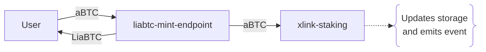

# liabtc-mint-endpoint

- Source code: `./contracts/liabtc/liabtc-mint-endpoint.clar`
<!-- - [Deployed contract](link-to-explorer) -->

Façade for [`xlink-staking`][1] contract designed to handle the lifecycle of the `LiaBTC` rebasing token (mint, burn and rebase operations).

## Rebase

This contract manages the LiaBTC token reserve through the [`rebase`](#rebase) public function. Burn and mint operations perfom a rebase every time they are executed. However, `rebase` can be called permissionlessly by any principal.

The rebasing mechanism is implemented via the "shares" concept. In this case, the LiaBTC reserve reperesents the value in `aBTC` of the staking shares held by the `liabtc-mint-endpoint`, as tracked by the [`xlink-staking`][1] contract.

For a detailed overview of the LiaBTC liquid token and its rebasing mechanism, see the [`token-liabtc`](token-liabtc.md) contract documentation.

## Mint

The mint operation consists of two main actions:

- User transfers `aBTC` to stake in the liquid pool.
- User receives `LiaBTC` in exchange, maintaining a 1:1 ratio (1 `aBTC` = 1 `LiaBTC`).

The `liabtc-mint-endpoint` contract acts as an `aBTC` staker within the [`xlink-staking`][1] contract. It serves as an abstraction layer, simplifying interactions between `LiaBTC` token holders and the liquid staking pool management provided by [`xlink-staking`][1].  

When a user mints `LiaBTC`, the transferred `aBTC` is sent to the XLink staking manager, which tracks the liquid staking status (shares and stake balances) and emits an event.

<!-- The `liabtc-mint-endpoint` is an `aBTC` staker in the [`xlink-staking`][1] contract, acting as a layer of abstraction between LiaBTC token holders and the liquid staking pool management handled by [`xlink-staking`][1].

When a user mints `LiaBTC`, the underlying `aBTC` is transferred to the XLink staking manager, which tracks the liquid staking status (shares and stake amounts). -->

## Burn

TODO:

## Storage

### `mint-paused`

| Data     | Type   |
| -------- | ------ |
| Variable | `bool` |

Indicates the operational status for the mint (stake) operations.

### `burn-paused`

| Data     | Type   |
| -------- | ------ |
| Variable | `bool` |

Indicates the operational status for the burn (unstake) operations.

### `burn-delay`

| Data     | Type   |
| -------- | ------ |
| Variable | `uint` |

Indicates waiting period for a burn request, measured in Bitcoin blocks (burn chain). It represents the time users must wait between initiating burn request and being able to finalize it.

### `use-whitelist`

| Data     | Type   |
| -------- | ------ |
| Variable | `bool` |

Indicates whether the whitelist mechanism is currently active. The whitelist applies to mint (stake) operations but not to burn (unstake) ones.

### `whitelisted`

| Data | Type             |
| ---- | ---------------- |
| Map  | `principal bool` |

Maintains a mapping of users (`principal`) to their whitelist status (`bool`).

### Relevant constants

#### `PENDING`

| Type     | Value  |
| -------- | ------ |
| `buff 1` | `0x00` |

Burn request pending status. When created, burn requests start with this status.

#### `FINALIZED`

| Type     | Value  |
| -------- | ------ |
| `buff 1` | `0x01` |

Burn request finalize status.

#### `REVOKED`

| Type     | Value  |
| -------- | ------ |
| `buff 1` | `0x02` |

Burn request revoked status.

## Features

### Public

#### `rebase`

Updates the LiaBTC token reserve by recalculating its value based on the staking shares held by the `liabtc-mint-endpoint` contract.

#### `mint`

Mints `LiaBTC` to the user (defined as `sender` within the contract) in exchange for `aBTC` at a 1:1 ratio. The provided `aBTC` is staked in the XLink staking manager by the `liabtc-mint-endpoint` on behalf of the user.

The `message` and `signature-packs` parameters serve as inputs to the [`xlink-staking::stake`][2] function. They are part of the XLink liquid staking pool's reward accrual mechanism, which operates permissionlessly and relies on validators.

##### Parameters

| Name              | Type                                                                            |
| ----------------- | ------------------------------------------------------------------------------- |
| `amount`          | `uint`                                                                          |
| `message`         | `{ token: principal, accrued-rewards: uint, update-block: uint }`               |
| `signature-packs` | `list 100 { signer: principal, message-hash: (buff 32), signature: (buff 65) }` |

#### `request-burn`

TODO:

##### Parameters

| Name              | Type                                                                            |
| ----------------- | ------------------------------------------------------------------------------- |
| `amount`          | `uint`                                                                          |
| `message`         | `{ token: principal, accrued-rewards: uint, update-block: uint }`               |
| `signature-packs` | `list 100 { signer: principal, message-hash: (buff 32), signature: (buff 65) }` |

#### `revoke-burn`

TODO:

##### Parameters

| Name              | Type                                                                            |
| ----------------- | ------------------------------------------------------------------------------- |
| `request-id`      | `uint`                                                                          |
| `message`         | `{ token: principal, accrued-rewards: uint, update-block: uint }`               |
| `signature-packs` | `list 100 { signer: principal, message-hash: (buff 32), signature: (buff 65) }` |

#### `finalize-burn`

TODO:

##### Parameters

| Name         | Type   |
| ------------ | ------ |
| `request-id` | `uint` |

#### `finalize-burn-many`

TODO:

##### Parameters

| Name          | Type             |
| ------------- | ---------------- |
| `request-ids` | `list 1000 uint` |

### Governance

TODO:

### Supporting features

#### `is-whitelisted-or-mint-for-all`

Checks if a given `principal` is eligible for minting under the current whitelist settings. If the whitelist is active, returns `false` if the user is not whitelisted. Returns `true` in all other cases.

##### Parameters

| Name   | Type        |
| ------ | ----------- |
| `user` | `principal` |

#### `validate-mint`

`xlink-staking::validate-stake` façade for handling `aBTC` staking. Within the contract, this function is solely called by the [`mint`](#mint) function. Throws if mint is paused or the `sender` is not whitelisted (when applicable).

##### Parameters

| Name     | Type   |
| -------- | ------ |
| `amount` | `uint` |

#### `validate-request-burn`

`xlink-staking::validate-unstake` façade for handling `aBTC` unstaking. Within the contract, this function is solely called by the [`request-burn`](#request-burn) function. Throws if burn is paused.

##### Parameters

| Name     | Type   |
| -------- | ------ |
| `amount` | `uint` |

#### `validate-revoke-burn`

Performs revoke burn validations and returns the corresponding request details. Within the contract, this function is solely called by the [`revoke-burn`](#revoke-burn) function. Validations encompass: burn is not paused, request exists, request has `PENDING` status and `sender` matches the `requested-by` field on the burn request (only the requestor can revoke).

##### Parameters

| Name         | Type   |
| ------------ | ------ |
| `request-id` | `uint` |

#### `validate-finalize-burn`

Performs finalize burn validations and returns the corresponding request details. Within the contract, this function is solely called by the [`finalize-burn`](#finalize-burn) function. Validations encompass: burn is not paused, request exists, request has `PENDING` status and the [`burn-delay`](#burn-delay) period has been completed.

##### Parameters

| Name         | Type   |
| ------------ | ------ |
| `request-id` | `uint` |

### Getters

#### `is-mint-paused`

Returns the [`mint-paused`](#mint-paused) variable.

#### `is-burn-paused`

Returns the [`burn-paused`](#burn-paused) variable.

#### `is-not-mint-paused-or-fail`

Throws with `err-paused` if mint is paused, returns `(ok true)` otherwise.

#### `is-not-burn-paused-or-fail`

Throws with `err-paused` if burn is paused, returns `(ok true)` otherwise.

#### `get-burn-request-or-fail`

Returns a burn request stored in the `liabtc-mint-registry`'s `burn-request` map. If entry doesn't exist, throws.

##### Parameters

| Name         | Type   |
| ------------ | ------ |
| `request-id` | `uint` |

#### `get-burn-request-or-fail-many`

Returns a list of burn requests stored in the `liabtc-mint-registry`. If any of the entries doesn't exist, throws.

##### Parameters

| Name          | Type             |
| ------------- | ---------------- |
| `request-ids` | `list 1000 uint` |

#### `get-burn-delay`

Returns the [`burn-delay`](#burn-delay) variable.

#### `get-current-bitcoin-block`

Getter for testing purposes. If mainnet, returns the `burn-block-height`.

## Contract calls

TODO:

- `liabtc-mint-registry`:
- `xlink-staking`:
- `token-liabtc`:
- `'SP2XD7417HGPRTREMKF748VNEQPDRR0RMANB7X1NK.token-abtc`:
<!-- TODO: LiaBTC DAO will switch to LISA's when going live. -->
- `'SP2XD7417HGPRTREMKF748VNEQPDRR0RMANB7X1NK.executor-dao`:

## Errors

| Error Name                         | Value         |
| ---------------------------------- | ------------- |
| `err-unauthorised`                 | `(err u1000)` |
| `err-paused`                       | `(err u7001)` |
| `err-request-pending`              | `(err u7006)` |
| `err-request-finalized-or-revoked` | `(err u7007)` |
| `err-not-whitelisted`              | `(err u7008)` |

[1]: xlink-staking.md
[2]: xlink-staking.md#stake

<!-- Documentation Contract Template v0.1.0 -->
