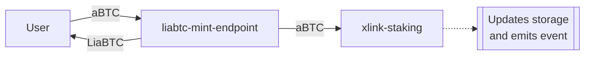

# liabtc-mint-endpoint

- Location: `xlink-dao/contracts/liabtc/liabtc-mint-endpoint.clar`
<!-- - [Deployed contract](link-to-explorer) -->

Façade for [`xlink-staking`][1] contract designed to handle the lifecycle of the `LiaBTC` rebasing token (mint, burn and rebase operations).

The `liabtc-mint-endpoint` contract acts as single `aBTC` staker within the [`xlink-staking`][1] contract. It serves as an abstraction layer, simplifying interactions between `LiaBTC` users and the liquid staking pool management provided by the [`xlink-staking`][1] contract, also known as XLink Staking Manager.

## Mint

The mint operation consists of two main actions:

- User transfers `aBTC` to stake in the liquid pool.
- User receives `LiaBTC` in exchange, maintaining a 1:1 ratio (1 `aBTC` = 1 `LiaBTC`).

When a user mints `LiaBTC`, the underlying `aBTC` is transferred to the Staking Manager, which tracks the liquid staking status (shares and stake balances) and emits an event.

## Burn

The burn operation is by which users can get back their `LiaBTC` and obtain `aBTC` in return with a 1:1 ratio. The burn operations are managed by the `liabtc-mint-registry` and has a waiting before `aBTC` are finally withdrawn.

### Request

User requests the burn of a certain amount of `LiaBTC`. In this step, `LiaBTC` tokens are burned and a burn request is created by the registry with a certain `request-id` and a [`PENDING`](#pending) status. The underlying `aBTC` are sent from the Staking Manager ulimately to the registry, which will hold the funds until finalization or revoke.

### Finalize

The user (or any other principal) can finalize the request when the [`burn-delay`](#burn-delay) period has passed (typically 1,000 Bitcoin blocks) and the corresponding `aBTC` are transferred to the requestor. The request status is swtiched to [`FINALIZED`](#finalized).

### Revoke

Burn requests can be revoked by the requestor. This operation transfers back the `aBTC` to the user and perform a `mint` within the same transaction. The resulting state is the requestor holding the same amount of `LiaBTC` that had before requesting. The request status is set to `REVOKE`.

## Rebase

This contract manages the `LiaBTC` token reserve through the [`rebase`](#rebase) public function. Burn and mint operations perfom a rebase every time they are executed. However, `rebase` can be called permissionlessly by any principal.

The rebasing mechanism is implemented via the "shares" concept. In this case, the `LiaBTC` reserve reperesents the value in `aBTC` of the staking shares held by the `liabtc-mint-endpoint`, as tracked by the [`xlink-staking`][1] contract.

The staking shares held by the `liabtc-mint-endpoint` are updated whenever a user mints or burns `LiaBTC`. The value of these shares in `aBTC` increases through the reinvestment of accrued staking rewards, which are restaked to grow the reserve over time.

For a detailed overview of the `LiaBTC` liquid token, see the [`token-liabtc`](token-liabtc.md) contract documentation.

## Features

### Public

#### `rebase`

Updates the LiaBTC token reserve by recalculating its value based on the staking shares held by the `liabtc-mint-endpoint` contract.

#### `mint`

Mints `LiaBTC` to the user (defined as `sender` within the contract) in exchange for `aBTC` at a 1:1 ratio. The provided `aBTC` is staked in the XLink staking manager by the `liabtc-mint-endpoint` on behalf of the user.

The `message` and `signature-packs` parameters serve as inputs to the [`xlink-staking::stake`][2] function. They are part of the XLink liquid staking pool's reward accrual mechanism, which operates permissionlessly and relies on validators.

##### Parameters

| Name              | Type                                                                            |
| ----------------- | ------------------------------------------------------------------------------- |
| `amount`          | `uint`                                                                          |
| `message`         | `{ token: principal, accrued-rewards: uint, update-block: uint }`               |
| `signature-packs` | `list 100 { signer: principal, message-hash: (buff 32), signature: (buff 65) }` |

#### `request-burn`

Initiates the burn procedure for a certain amount of `LiaBTC`. Several actions are performed:

- `LiaBTC` amount is burned from the user wallet.
- The amount of `aBTC` is unstaked from the Staking Manager.
- The unstaked `aBTC` is transferred from the `xlink-staking` to the `liabtc-mint-endpoint` and then to the `liabtc-mint-registry` to be holded until finalization o revoke.
- A request with `PENDING` status is created on the registry.

As with `mint`, the `message` and `signature-packs` parameters serve as inputs to the [`xlink-staking::unstake`][3] function.

##### Parameters

| Name              | Type                                                                            |
| ----------------- | ------------------------------------------------------------------------------- |
| `amount`          | `uint`                                                                          |
| `message`         | `{ token: principal, accrued-rewards: uint, update-block: uint }`               |
| `signature-packs` | `list 100 { signer: principal, message-hash: (buff 32), signature: (buff 65) }` |

#### `revoke-burn`

Revokes a burn request. Only the requestor (`requested-by` field of the request) can call this function. Funds are returned back to user as in `finalize-request` with the difference that the `mint` function is invoked to stake the amount again and mint `LiaBTC` back to the user. Request status is set to `REVOKED`.

##### Parameters

| Name              | Type                                                                            |
| ----------------- | ------------------------------------------------------------------------------- |
| `request-id`      | `uint`                                                                          |
| `message`         | `{ token: principal, accrued-rewards: uint, update-block: uint }`               |
| `signature-packs` | `list 100 { signer: principal, message-hash: (buff 32), signature: (buff 65) }` |

#### `finalize-burn`

Finalizes a burn request by transferring the `aBTC` funds from the registry to the user (`requested-by` field of the request). Request is set as `FINALIZED`. Anyone can call.

##### Parameters

| Name         | Type   |
| ------------ | ------ |
| `request-id` | `uint` |

#### `finalize-burn-many`

Finalizes requests in bulk.

##### Parameters

| Name          | Type             |
| ------------- | ---------------- |
| `request-ids` | `list 1000 uint` |

### Governance

The following functions are guarded by the [`is-dao-or-extension`](#is-dao-or-extension) function. This implies that only the LISA DAO or an enabled extension can use these features.

#### `set-use-whitelist`

Sets the [`use-whitelist`](#use-whitelist) variable.

##### Parameters

| Name      | Type   |
| --------- | ------ |
| `new-use` | `bool` |

#### `set-whitelisted`

Assigns the whitelist status of a user. Modifies the [`whitelisted`](#whitelisted) map.

##### Parameters

| Name              | Type        |
| ----------------- | ----------- |
| `user`            | `principal` |
| `new-whitelisted` | `bool`      |

#### `set-whitelisted-many`

Assigns the whitelist status of users in bulk.

##### Parameters

| Name              | Type                  |
| ----------------- | --------------------- |
| `users`           | `list 1000 principal` |
| `new-whitelisted` | `list 1000 bool`      |

#### `set-mint-paused`

Sets the [`mint-paused`](#mint-paused) variable.

##### Parameters

| Name         | Type   |
| ------------ | ------ |
| `new-paused` | `bool` |

#### `set-burn-paused`

Sets the [`burn-paused`](#burn-paused) variable.

##### Parameters

| Name         | Type   |
| ------------ | ------ |
| `new-paused` | `bool` |

#### `set-burn-delay`

Sets the [`burn-delay`](#burn-delay) variable.

##### Parameters

| Name        | Type   |
| ----------- | ------ |
| `new-delay` | `uint` |

### Supporting features

#### `is-dao-or-extension`

This standard protocol function checks whether the `contract-caller` is an enabled extension within the DAO or the `tx-sender` is the DAO itself (proposal execution scenario). The enabled extension check is delegated to the LISA's `executor-dao` contract.

#### `is-whitelisted-or-mint-for-all`

Checks if a given `principal` is eligible for minting under the current whitelist settings. If the whitelist is active, returns `false` if the user is not whitelisted. Returns `true` in all other cases.

##### Parameters

| Name   | Type        |
| ------ | ----------- |
| `user` | `principal` |

#### `validate-mint`

`xlink-staking::validate-stake` façade for handling `aBTC` staking. Within the contract, this function is solely called by the [`mint`](#mint) function. Throws if mint is paused or the `sender` is not whitelisted (when applicable).

##### Parameters

| Name     | Type   |
| -------- | ------ |
| `amount` | `uint` |

#### `validate-request-burn`

`xlink-staking::validate-unstake` façade for handling `aBTC` unstaking. Within the contract, this function is solely called by the [`request-burn`](#request-burn) function. Throws if burn is paused.

##### Parameters

| Name     | Type   |
| -------- | ------ |
| `amount` | `uint` |

#### `validate-revoke-burn`

Performs revoke burn validations and returns the corresponding request details. Within the contract, this function is solely called by the [`revoke-burn`](#revoke-burn) function. Validations encompass: burn is not paused, request exists, request has `PENDING` status and `sender` matches the `requested-by` field on the burn request (only the requestor can revoke).

##### Parameters

| Name         | Type   |
| ------------ | ------ |
| `request-id` | `uint` |

#### `validate-finalize-burn`

Performs finalize burn validations and returns the corresponding request details. Within the contract, this function is solely called by the [`finalize-burn`](#finalize-burn) function. Validations encompass: burn is not paused, request exists, request has `PENDING` status and the [`burn-delay`](#burn-delay) period has been completed.

##### Parameters

| Name         | Type   |
| ------------ | ------ |
| `request-id` | `uint` |

### Getters

#### `is-mint-paused`

Returns the [`mint-paused`](#mint-paused) variable.

#### `is-burn-paused`

Returns the [`burn-paused`](#burn-paused) variable.

#### `is-not-mint-paused-or-fail`

Throws with `err-paused` if mint is paused, returns `(ok true)` otherwise.

#### `is-not-burn-paused-or-fail`

Throws with `err-paused` if burn is paused, returns `(ok true)` otherwise.

#### `get-burn-request-or-fail`

Returns a burn request stored in the `liabtc-mint-registry`'s `burn-request` map. If entry doesn't exist, throws.

##### Parameters

| Name         | Type   |
| ------------ | ------ |
| `request-id` | `uint` |

#### `get-burn-request-or-fail-many`

Returns a list of burn requests stored in the `liabtc-mint-registry`. If any of the entries doesn't exist, throws.

##### Parameters

| Name          | Type             |
| ------------- | ---------------- |
| `request-ids` | `list 1000 uint` |

#### `get-burn-delay`

Returns the [`burn-delay`](#burn-delay) variable.

#### `get-current-bitcoin-block`

Getter for testing purposes. If mainnet, returns the `burn-block-height`.

## Storage

### `mint-paused`

| Data     | Type   |
| -------- | ------ |
| Variable | `bool` |

Indicates the operational status for the mint (stake) operations.

### `burn-paused`

| Data     | Type   |
| -------- | ------ |
| Variable | `bool` |

Indicates the operational status for the burn (unstake) operations.

### `burn-delay`

| Data     | Type   |
| -------- | ------ |
| Variable | `uint` |

Indicates waiting period for a burn request, measured in Bitcoin blocks (burn chain). It represents the time users must wait between initiating burn request and being able to finalize it.

### `use-whitelist`

| Data     | Type   |
| -------- | ------ |
| Variable | `bool` |

Indicates whether the whitelist mechanism is currently active. The whitelist applies to mint (stake) operations but not to burn (unstake) ones.

### `whitelisted`

| Data | Type             |
| ---- | ---------------- |
| Map  | `principal bool` |

Maintains a mapping of users (`principal`) to their whitelist status (`bool`).

### Relevant constants

#### `PENDING`

| Type     | Value  |
| -------- | ------ |
| `buff 1` | `0x00` |

Burn request pending status. When created, burn requests start with this status.

#### `FINALIZED`

| Type     | Value  |
| -------- | ------ |
| `buff 1` | `0x01` |

Burn request finalize status.

#### `REVOKED`

| Type     | Value  |
| -------- | ------ |
| `buff 1` | `0x02` |

Burn request revoked status.

## Contract calls

- `xlink-staking`: The Staking Manager is called in the core operations of the contract: every time a user mints/burns, the corresponding stake/unstake operations are delegated to this contract. Additionally, the Staking Manager is essential to perfom the `LiaBTC` rebase by retrieving the value of `aBTC` held by the `liabtc-mint-endpoint` as a staker within the protocol.
- `liabtc-mint-registry`: Calls to the registry are performed to handle burn requests and funds management when burning/unstaking.
- `token-liabtc`: This contract is called to perform three essential actiosn: rebase, mint and burn.
- `'SP2XD7417HGPRTREMKF748VNEQPDRR0RMANB7X1NK.token-abtc`: As the token that values `LiaBTC`, calls to this contract are to perform transfers and indicate the token that is being staked in the Staking Manager.
<!-- TODO: LiaBTC DAO will switch to LISA's DAO when going live. -->
- `'SP2XD7417HGPRTREMKF748VNEQPDRR0RMANB7X1NK.executor-dao`: Solely used by [`is-dao-or-extension`](#is-dao-or-extension) function for authorization of governance operations.

## Errors

| Error Name                         | Value         |
| ---------------------------------- | ------------- |
| `err-unauthorised`                 | `(err u1000)` |
| `err-paused`                       | `(err u7001)` |
| `err-request-pending`              | `(err u7006)` |
| `err-request-finalized-or-revoked` | `(err u7007)` |
| `err-not-whitelisted`              | `(err u7008)` |

[1]: xlink-staking.md
[2]: xlink-staking.md#stake
[3]: xlink-staking.md#unstake

<!-- Documentation Contract Template v0.1.1 -->
